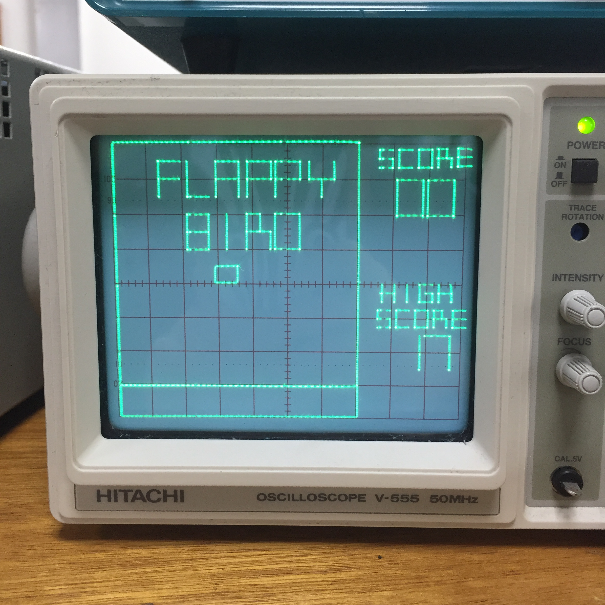
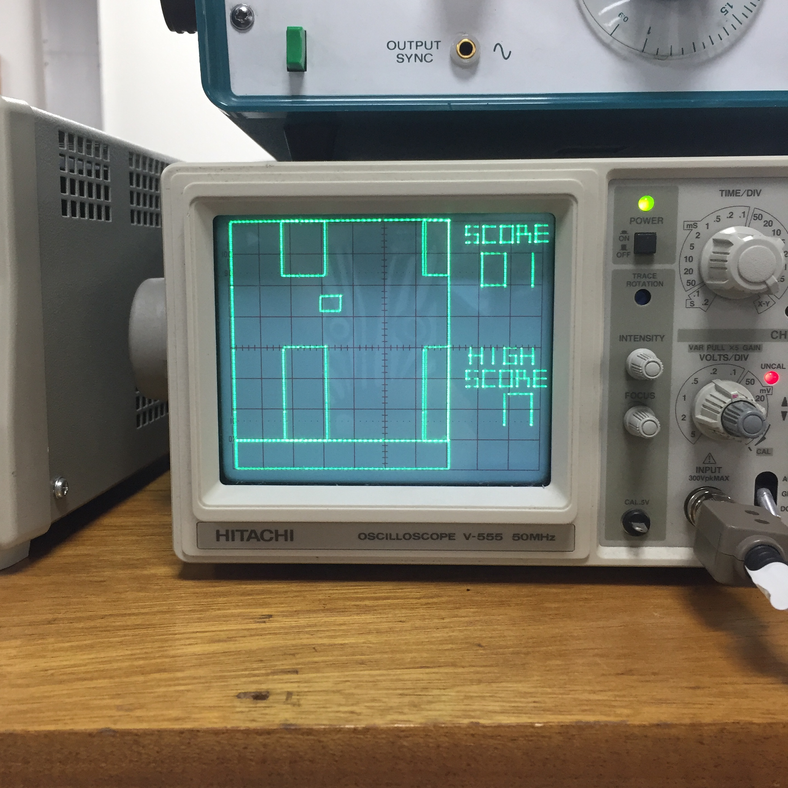
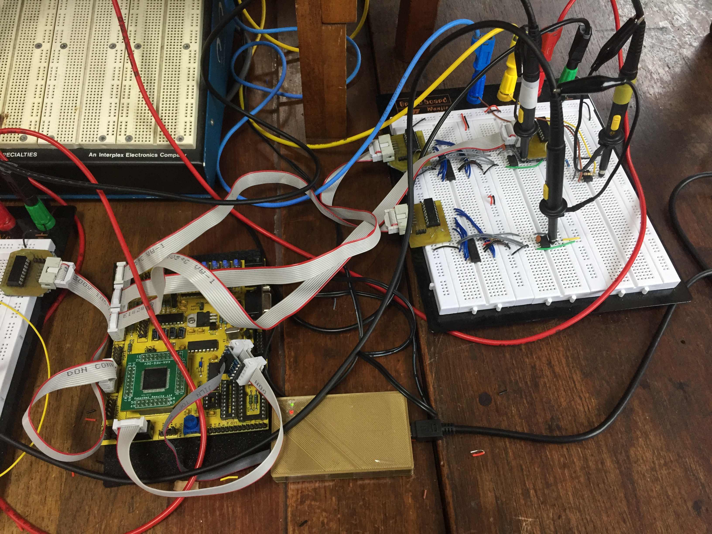
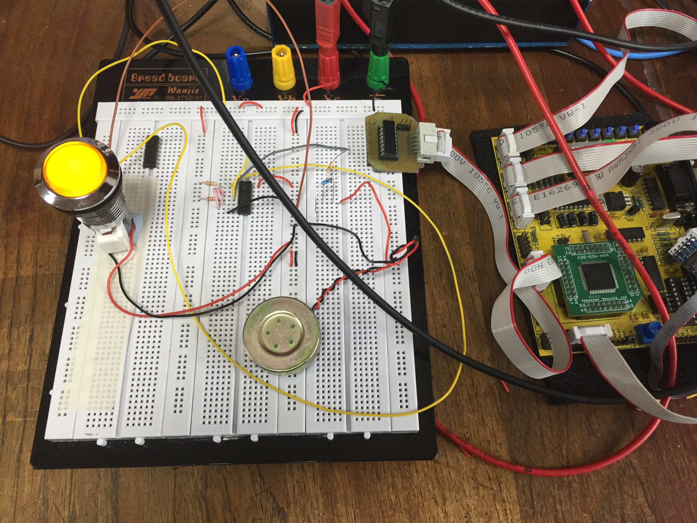
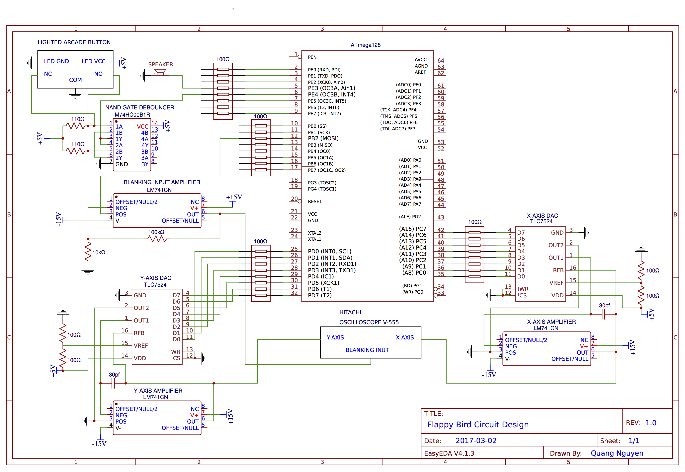

# Flappy Bird Game for ATmega128 Microcontroller
This project ports the Flappy Bird game to a microcontroller system. The game's graphics are handled by an oscilloscope, and the game's input is handled by a lighted arcade button. The microcontroller used was the Atmel ATmega128. Below are some pictures of the completed system and you can watch a video of gameplay on YouTube [here](https://youtu.be/5vsGyt09EX8).

</img>
</img>
</img>
</img>

## Hardware Setup 
The table below details the hardware components required to build the circuit.

| Item Description                | Product Code      | Quantity|
| ------------------------------- | ----------------- | ------- |
| Microcontroller                 | Atmel ATmega128   | 1       |
| Operational Amplifier           | LM741CN           | 3       |
| 8-bit Digital-Analog Converters | TLC7524           | 2       |
| 100Ω Resistor Packs             | 4116RLF           | 4       |
| NAND Gates                      | M74HC00B1R        | 1       |
| Oscilloscope                    | Hitachi V-555     | 1       |
| 30pF Capacitors                 |                   | 2       |
| 100Ω Resistors                  |                   | 4       |
| 110Ω Resistors                  |                   | 2       |
| Lighted Arcade Button           |                   | 1       |
| Speaker                         |                   | 1       |
| ATmega128 JTAG interface        |                   | 1       |

The oscilloscope should be set to X-Y mode with medium-high intensity. Channels' settings are 0.2V/div. Adjust the default position of the cursor to top right of the screen. Blanking Input port can be found at the back of the oscilloscope. The electronic circuit diagram is detailed below.

## Installation Instructions
1. Download and install [ATMEL Studio 7.0](http://www.atmel.com/tools/atmelstudio.aspx)
2. Create a **New Project**
3. In the pop-up window, pick **Assembler** as the *programming language*, choose an appropriate *name* and *location* for your project, and then click **OK**.
4. In the next window, select **ATmega128** as the *device*, and then click **OK**.
5. Duplicate the content of the **main.asm** file from this folder to your own project.
6. Ensure that ATmega128 JTAG interface is installed.
7. Click on the hammer icon to open project properties.
8. Choose **JTAG** as the *selected debugger/programmer*, save and then close.
9. Click on the red run button to load the programme to your microcontroller.

## Game Settings
The speed of the game can be changed by changing the values OCR1A. OCR1A contains the high byte (OCR1AH) and the low byte (OCR1AL). The lower the value of OCR1A, the faster the gameplay.

## Help & Support
If you need help, send me an [email](mailto:qn14@ic.ac.uk), and I will try my best to help. If you would like to read the full report on the programme, you can find it [here](ProjectReport.pdf).

## Contributors
[Christopher Page](https://www.facebook.com/chris.page.5817) and
[Quang Nguyen](https://github.com/ngcaden)

## Licensing
This project was released under [MIT License](LICENSE.md).
